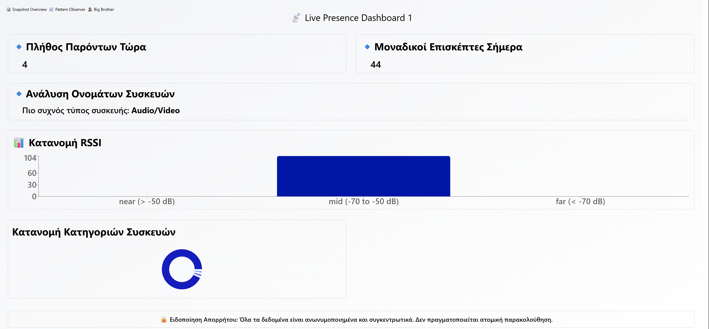

# Ubiquitous Computing - Live Bluetooth Environment Monitor


This project is a web-based dashboard for monitoring Bluetooth devices in the local environment. It captures device presence, analyzes patterns, and displays synthetic behavioral insights. The system consists of Python scripts for scanning and data seeding, a Next.js application for the frontend and API, and a MySQL database for data storage.

This project was developed for the CEID_NE576 — Ubiquitous Computing Live Exercise 2024/25 course by Orestis Antonis Makris, under Prof. Andreas Komninos.

## Features

*   **Live Device Tracking:** Displays currently visible Bluetooth devices.
*   **Multiple Dashboard Views:**
    *   **Dashboard One:** General presence statistics (live count, daily unique, device type analysis).  
        
    *   **Dashboard Two:** Pattern observer for temporary device names, proximity clusters, and recent activity timeline.  
        
    *   **Dashboard Three:** "Active Surveillance Profiles" with detailed synthetic movement and social insights for selected devices.  
        
*   **Anonymization:** Uses hashed MAC addresses as pseudonyms.

## Tech Stack & Dependencies

- **Frontend & Backend**  
  - Next.js (React) + Tailwind CSS  
  - Recharts (charts)  
  - Node.js API routes  
- **Database**  
  - MySQL or MariaDB (>=5.7)  
- **Python Scanning & Seeding**  
  - `scan_bt.py` (uses `bleak`, PyBluez / `bluetooth` module)  
  - `seed_patterns.py` (uses `mysql-connector-python`)  
- **Other Dependencies**  
  - Python 3.8+ (`asyncio`, `requests`, `bleak`)  
  - Linux Bluetooth dev libraries: `libbluetooth-dev`, `libglib2.0-dev`

## Project Structure

```
Ubiquitous-Computing/
├── ubicomp-dashboard/        # Next.js project
│   ├── app/                  # Next.js App Router (layout, globals)
│   ├── components/           # React components (Dashboards, UI elements)
│   ├── lib/                  # Database connection (db.js)
│   ├── pages/                # Next.js Pages Router (index, API routes)
│   │   └── api/              # API endpoints
│   ├── public/               # Static assets
│   ├── next.config.ts
│   ├── package.json
│   ├── seed_patterns.py      # Python script to seed synthetic pattern data
│   └── ...
├── Python_Scanning/          # Directory for Python scanning scripts
│   ├── scan_bt.py            # Python script for BLE device scanning (run on Windows/Linux, raspberry pi bleutooth may have issues)
│   └── 
├── INSTALLATION_GUIDE.md    # Detailed installation guide
└── README.md                 # This file
```

## Setup and Installation

Refer to `INSTALLATION_GUIDE.md` for detailed setup instructions.

**Quick Overview:**

1.  **Prerequisites:**
    *   Node.js (LTS version recommended, e.g., v18+)
    *   Python (3.8+ recommended)
    *   MySQL Server
    *   Git
    *   (Linux for scanner) Bluetooth development libraries (e.g., `libbluetooth-dev`, `libglib2.0-dev` for `bleak`).
2.  **Clone the repository.**
3.  **Setup MySQL Database:** Create a database (e.g., `dashboard`) and the required tables (`device_sessions`, `synthetic_patterns`).
4.  **Configure Python Scripts:**
    *   Create a Python virtual environment and install dependencies (`bleak`, `requests`, `mysql-connector-python`).
    *   Update database credentials in `seed_patterns.py`.
    *   Update `SERVER_URL` (e.g., `http://localhost:3000/api/device-log`) and `SESSION_KEY` in `scanner.py`.
5.  **Configure Next.js Application (`ubicomp-dashboard`):**
    *   Update database credentials in `lib/db.js`.
    *   Ensure `SESSION_KEY` in `pages/api/device-log.js` matches the one in `scanner.py`.
    *   Install Node.js dependencies: `npm install`.

## Running the Project

1.  **Start MySQL Server.**
2.  **Run the Python Scanner:**
    ```bash
    # Navigate to the root project directory
    # Activate your Python virtual environment
    python scanner.py
    ```
3.  **Run the Python Data Seeder (Optional, for initial data or updates):**
    ```bash
    # Navigate to the root project directory
    # Activate your Python virtual environment
    python seed_patterns.py
    ```
4.  **Start the Next.js Development Server:**
    ```bash
    # Navigate to the ubicomp-dashboard directory
    npm run dev
    ```
5.  Access the dashboard in your browser, typically at `http://localhost:3000`.

## Key Scripts

*   **`scan_bt.py:** Actively scans for BLE devices using `bleak` and sends data to the `/api/device-log` endpoint.
*   **`seed_patterns.py`:** Populates the `synthetic_patterns` table in the database with generated movement and social insights.

## API Endpoints

All under `ubicomp-dashboard/pages/api/`:

- **POST** `/api/device-log.js`  
  Ingests scanner payload, pseudonymizes MAC → `device_sessions`.  
- **GET** `/api/live-count.js`  
  Returns count of distinct devices seen in the last 20 s.  
- **GET** `/api/daily-unique.js`  
  Returns unique devices seen since 00:00 (or configured day start).  
- **GET** `/api/name-analysis.js`  
  Returns the most common `major_class` among recent devices.  
- **GET** `/api/class-distribution.js`  
  Returns data for a pie chart of `major_class` proportions.  
- **GET** `/api/rssi-histogram.js`  
  Returns counts of signal‐strength bins (near/mid/far).  
- **GET** `/api/visible-devices.js`  
  Returns currently visible devices, durations & “new” flags.  
- **GET** `/api/device-events.js`  
  Returns a timestamp sequence of detection events (last 15 min).  
- **GET** `/api/pattern-last-seen.js`  
  Merges real “Last Seen” markers + synthetic “Last spotted at…” messages.  
- **GET** `/api/pattern-cooccur.js`  
  Returns synthetic and co-location “social insights” messages.  
- **GET** `/api/pattern-routine.js`  
  Returns synthetic routine-based activity messages.
  
## Key Scripts
- **scan_bt.py**: Replaces old `scanner.py`; scans BLE & Classic, hashes MAC + SESSION_KEY, posts to `/api/device-log`.  
- **seed_patterns.py**: Generates 2–4 “Last spotted…” + 2–4 social insights per pseudonym and upserts into `synthetic_patterns`.  

## Author

*   **Orestis Antonis Makris** (AM 1084516)  — CEID_NE576
Distributed under the MIT License.  
```
